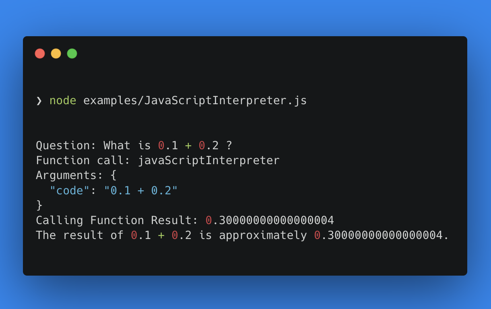

# OpenAI Function calling tools


<a href="https://www.npmjs.com/package/openai-function-calling-tools"></a>
[](https://github.com/JohannLai/openai-function-calling-tools/blob/main/LICENSE)


---

OpenAI Function calling tools 

OpenAI Function calling tools is a repository that offers a set of tools to help you easy to build a function calling model with OpenAI API.

[More information about function calling](https://platform.openai.com/docs/guides/gpt/function-calling)

JavaScriptInterpreter Sample. 



## 🪓 Tools
The repo provides the following tools you can use out of the box:
- ⏰ Clock: A clock that can tell you the time.
- 🧮 Calculator: A simple calculator that can do basic arithmetic. Input should be a math expression.
- 🔍 GoogleCustomSearch: A wrapper around the Google Custom Search API. Useful for when you need to answer questions about current events. Input should be a search query.
- 📁 fs: WriteFileTool abd ReadFileTool access to the file system. Input should be a file path and text written to the file.
- 🔥 JavaScriptInterpreter: A JavaScript interpreter. Input should be a JavaScript program string.
- 🚧 webbrowser: A web browser that can open a website. Input should be a URL.
- 🚧 sql: Input to this tool is a detailed and correct SQL query, output is a result from the database.


## 📦 Quick Install
  
  ```bash 
  npm install openai-function-calling-tools
  ```


## 📖 Usage
```js
import { GoogleCustomSearch } from 'openai-function-calling-tools';
// * googleCustomSearch is a function that takes a search query and returns a result from the Google Custom Search API.
// * googleCustomSearchSchema is the json schema for the input to googleCustomSearch. 
// Can be used at OpenAI createChatCompletion API functions parameter.
const { googleCustomSearch, googleCustomSearchSchema } = new GoogleCustomSearch({
  apiKey: process.env.GOOGLE_API_KEY,
  googleCSEId: process.env.GOOGLE_CSE_ID,
});
```
<details><summary>Full example code</summary>
Just 3 steps to use the tools in your OpenAI API project. 
<p>

```js
const { Configuration, OpenAIApi } = require("openai");
const { GoogleCustomSearch } = require("openai-function-calling-tools");

const main = async () => {
  const configuration = new Configuration({
    apiKey: process.env.OPENAI_API_KEY,
  });
  const openai = new OpenAIApi(configuration);

  const QUESTION = "How many tesla model 3 sale in 2022?"

  const messages = [
    {
      role: "user",
      content: QUESTION,
    },
  ];

  // ✨ STEP 1: new the tools you want to use
  const { googleCustomSearch, googleCustomSearchSchema } =
    new GoogleCustomSearch({
      apiKey: process.env.GOOGLE_API_KEY,
      googleCSEId: process.env.GOOGLE_CSE_ID,
    });


  // ✨ STEP 2:  add the tools to the functions object 
  const functions = {
    googleCustomSearch,
  };

  const getCompletion = async (messages) => {
    const response = await openai.createChatCompletion({
      model: "gpt-3.5-turbo-0613",
      messages,
      // ✨ STEP 3: add the tools schema to the functions parameter
      functions: [googleCustomSearchSchema],
      temperature: 0,
    });

    return response;
  };
  let response;

  console.log("Question: " + QUESTION);

  while (true) {
    response = await getCompletion(messages);

    if (response.data.choices[0].finish_reason === "stop") {
      console.log(response.data.choices[0].message.content);
      break;
    } else if (response.data.choices[0].finish_reason === "function_call") {
      const fnName = response.data.choices[0].message.function_call.name;
      const args = response.data.choices[0].message.function_call.arguments;

      const fn = functions[fnName];
      const result = await fn(...Object.values(JSON.parse(args)));

      console.log(`Function call: ${fnName}, Arguments: ${args}`);
      console.log(`Calling Function ${fnName} Result: ` + result);

      messages.push({
        role: "assistant",
        content: "",
        function_call: {
          name: fnName,
          arguments: args,
        },
      });

      messages.push({
        role: "function",
        name: fnName,
        content: JSON.stringify({ result: result }),
      });
    }
  }
};

main();
```

</p>
</details>

## 💻 Supported Environments
- Node.js v16 or higher
- Cloudflare Workers
- Vercel / Next.js (BAckend, Serverless and Edge functions)
- Supabase Edge Functions
- 🚧 Browser

## 🌟 Inspiration
- LangChainAI