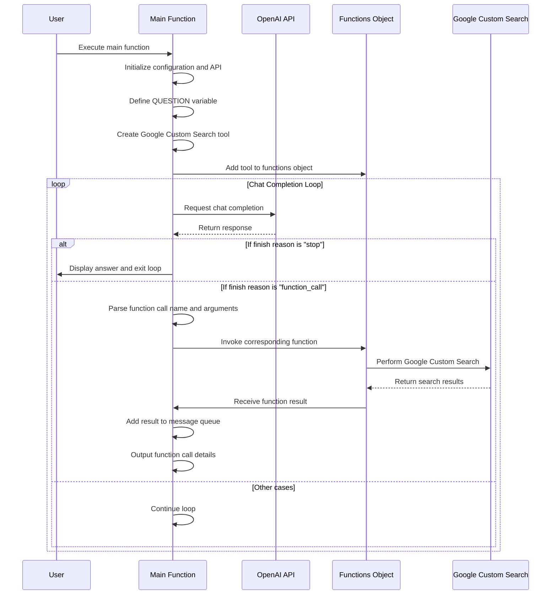

# OpenAI Function calling tools


<a href="https://www.npmjs.com/package/openai-function-calling-tools"></a>
[](https://github.com/JohannLai/openai-function-calling-tools/blob/main/LICENSE)
[](https://codecov.io/github/JohannLai/openai-function-calling-tools)


---

OpenAI Function calling tools

OpenAI Function calling tools is a repository that offers a set of tools to help you easy to build a function calling model with OpenAI API.

[More information about function calling](https://platform.openai.com/docs/guides/gpt/function-calling)

Sample: https://chatFn.io


## 🪓 Tools
The repo provides the following tools you can use out of the box:

- 🗺️ ShowPoisOnMap: A tool that can show points of interest on a map.
- 🌐 ReverseGeocode: A tool that can convert coordinates into a human-readable address.
- ⏰ Clock: A clock that can tell you the time.
- 🧮 Calculator: A simple calculator that can do basic arithmetic. Input should be a math expression.
- 🔍 GoogleCustomSearch: A wrapper around the Google Custom Search API. Useful for when you need to answer questions about current events. Input should be a search query.
- 🔍 BingCustomSearch: A wrapper around the Bing Custom Search API. Useful for when you need to answer questions about current events. Input should be a search query.
- 🔍 SerperCustomSearch: A wrapper around the SerpAPI. Useful for when you need to answer questions about current events. Input should be a search query.
- 🏞️ SerperImagesSearch: Use SerpAPI to search images. Input should be a search query.
- 📁 fs: WriteFileTool abd ReadFileTool access to the file system. Input should be a file path and text written to the file.
- 🪩 webbrowser: A web browser that can open a website. Input should be a URL.
- 🚧 sql: Input to this tool is a detailed and correct SQL query, output is a result from the database.
- 🚧 JavaScriptInterpreter: A JavaScript interpreter. Input should be a JavaScript program string.

> You can use `{ Tool }` factory function to create a tool instance. See `/tools` for more examples.


## 📦 Quick Install

  ```bash
  npm install openai-function-calling-tools
  ```

## 📖 Usage

### Example 1: Function Calls

use JavaScriptInterpreter to calculate 0.1 + 0.2

```js
import { Configuration, OpenAIApi } from "openai";
import { createCalculator } from "openai-function-calling-tools"

const configuration = new Configuration({
    apiKey: process.env.OPENAI_API_KEY,
  });
const openai = new OpenAIApi(configuration);

const QUESTION = "What is 100*2?";

const messages = [
  {
    role: "user",
    content: QUESTION,
  },
];

# ✨ STEP 1: new the tools you want to use
const [calculator, calculatorSchema] = createCalculator();

# ✨ STEP 2:  add the tools to the functions object
const functions = {
  calculator,
};

const getCompletion = async (messages) => {
  const response = await openai.createChatCompletion({
    model: "gpt-3.5-turbo-0613",
    messages,
    # ✨ STEP 3: add the tools to the schema
    functions: [calculatorSchema],
    temperature: 0,
  });

  return response;
};

console.log("Question: " + QUESTION);
let response = await getCompletion(messages);

if (response.data.choices[0].finish_reason === "function_call") {
  const fnName = response.data.choices[0].message.function_call.name;
  const args = response.data.choices[0].message.function_call.arguments;

  console.log("Function call: " + fnName);
  console.log("Arguments: " + args);

  # ✨ STEP 4: call the function
  const fn = functions[fnName];
  const result = fn(JSON.parse(args));

  console.log("Calling Function Result: " + result);

  messages.push({
    role: "assistant",
    content: null,
    function_call: {
      name: fnName,
      arguments: args,
    },
  });

  messages.push({
    role: "function",
    name: fnName,
    content: JSON.stringify({ result: result }),
  });

  // call the completion again
  response = await getCompletion(messages);

  console.log(response.data.choices[0].message.content);
}
```

### Example 2: Function Calls with Google Custom Search

> 📝 Note: You need to apply for a Google Custom Search API key and a Google Custom Search Engine ID to use this tool.

#### The following is a sequence diagram of the example

#### Code

```js
const { Configuration, OpenAIApi } = require("openai");
const { createGoogleCustomSearch } = require("openai-function-calling-tools");

const main = async () => {
  const configuration = new Configuration({
    apiKey: process.env.OPENAI_API_KEY,
  });
  const openai = new OpenAIApi(configuration);

  const QUESTION = "How many tesla model 3 sale in 2022?"

  const messages = [
    {
      role: "user",
      content: QUESTION,
    },
  ];

  // ✨ STEP 1: new the tools you want to use
  const [googleCustomSearch, googleCustomSearchSchema] =
    createGoogleCustomSearch({
      apiKey: process.env.GOOGLE_API_KEY,
      googleCSEId: process.env.GOOGLE_CSE_ID,
    });


  // ✨ STEP 2:  add the tools to the functions object
  const functions = {
    googleCustomSearch,
  };

  const getCompletion = async (messages) => {
    const response = await openai.createChatCompletion({
      model: "gpt-3.5-turbo-0613",
      messages,
      // ✨ STEP 3: add the tools schema to the functions parameter
      functions: [googleCustomSearchSchema],
      temperature: 0,
    });

    return response;
  };
  let response;

  console.log("Question: " + QUESTION);

  while (true) {
    response = await getCompletion(messages);

    if (response.data.choices[0].finish_reason === "stop") {
      console.log(response.data.choices[0].message.content);
      break;
    } else if (response.data.choices[0].finish_reason === "function_call") {
      const fnName = response.data.choices[0].message.function_call.name;
      const args = response.data.choices[0].message.function_call.arguments;

      const fn = functions[fnName];
      const result = await fn(JSON.parse(args));

      console.log(`Function call: ${fnName}, Arguments: ${args}`);
      console.log(`Calling Function ${fnName} Result: ` + result);

      messages.push({
        role: "assistant",
        content: "",
        function_call: {
          name: fnName,
          arguments: args,
        },
      });

      messages.push({
        role: "function",
        name: fnName,
        content: JSON.stringify({ result: result }),
      });
    }
  }
};

main();
```


### Example 3: Schema Extraction

Example to extract schema from a function call

Tree structure:

```js
import { Configuration, OpenAIApi } from "openai";

const configuration = new Configuration({
  apiKey: process.env.OPENAI_API_KEY,
});
const openai = new OpenAIApi(configuration);

const getCompletion = async (messages) => {
  const response = await openai.createChatCompletion({
    model: "gpt-3.5-turbo-0613",
    messages: [
      {
        role: "user",
        content: `root
              ├── folder1
              │   ├── file1.txt
              │   └── file2.txt
              └── folder2
                  ├── file3.txt
                      └── subfolder1
                              └── file4.txt`
      },
    ],
    functions: [
      {
        "name": "buildTree",
        "description": "build a tree structure",
        "parameters": {
          "type": "object",
          "properties": {
            "name": {
              "type": "string",
              "description": "The name of the node"
            },
            "children": {
              "type": "array",
              "description": "The tree nodes",
              "items": {
                "$ref": "#"
              }
            },
            "type": {
              "type": "string",
              "description": "The type of the node",
              "enum": [
                "file",
                "folder"
              ]
            }
          },
          "required": [
            "name",
            "children",
            "type"
          ]
        }
      }
    ],
    temperature: 0,
  });

  return response;
};

let response = await getCompletion();

if (response.data.choices[0].finish_reason === "function_call") {
  const args = response.data.choices[0].message.function_call.arguments;
  // 🌟 output the Tree structure data
  console.log(args);
}
```

## 💻 Supported Environments
- Node.js v16 or higher
- Cloudflare Workers
- Vercel / Next.js (Backend, Serverless and Edge functions 🔥)
- Supabase Edge Functions
- 🚧 Browser

## 🛡️ Safe for Production
[](https://www.murphysec.com/console/report/1671046840954470400/1671046841000607744)

## 🌟 Inspiration
- LangChainAI
